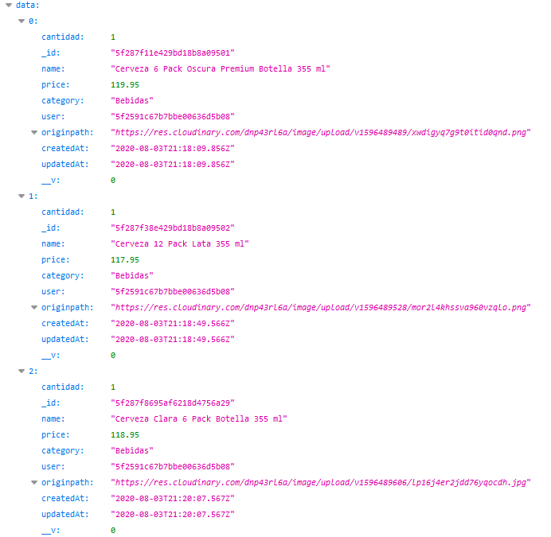
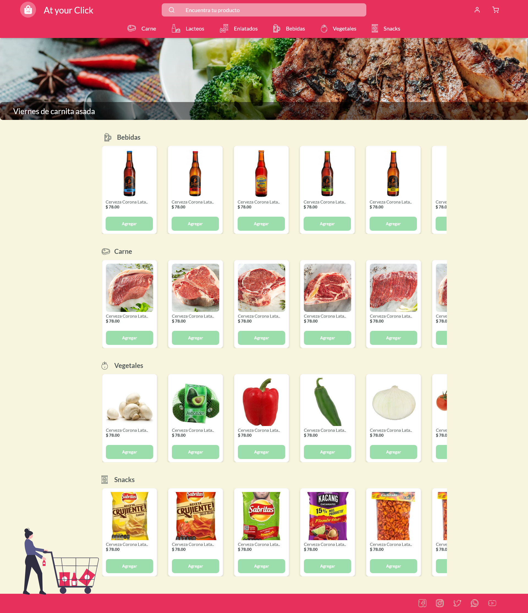

# Master Eats

## Description

Food market Web Application Project

## Scope

This application aims at helping businesses offer food products and market-related news.

By visiting this website, the user will be able to:

- Search for items
- Filter items by using categories
- Add and delete items to a cart
- The purchase process will implement..
- In order to complete the purchase process, the user must be logged in. Otherwise, he or she will be redirected to the Sign-up and Sign-in section.

## Authors

- Alejandro Ortiz
- Alexander Alvarez
- Camilo Andres Alfonso Suarez
- Felipe Chavez
- Juan Camilo Moreno
- Walter Salas

## Wireframes

- [Home Page](https://docs.google.com/drawings/d/1nLAGowmQsTm9Fm_FjySarD3YVaQZlAsiq2SaSrFgP7E/edit?usp=sharing)
- [Categories](https://docs.google.com/drawings/d/1QdsPcsVG0hfi45lQyUkz_gAcpHL_o-zaIZkjZZZVys8/edit?usp=sharing)
- [Cart](https://docs.google.com/drawings/d/15oOWtrWIawqNjZeiD1g8ddk5lNrah_iRq6bFGQC2AwE/edit?usp=sharing)
- [SignIn/SignUp](https://docs.google.com/drawings/d/1fD4bgBp5PBWeh1o_za6U2wZEtbIhDcAPfxm15pcp7OA/edit?usp=sharing)
- [Account](https://docs.google.com/drawings/d/1CNXst-WBV_pSlThwBVMDMtAF5rJYv3y66pYFcrUw88s/edit?usp=sharing)

## Mock Ups

- [MockUps Adobe XD](https://xd.adobe.com/view/4ad7fd99-177a-427a-857d-4103f2bb4ee1-1f84/)

## Roles

- Alexander: MainPage - Header - Footer
- Felipe Chavez: SignIn/SignUp
- Juan Camilo: Cart
- Camilo Andres: Account
- Walter: Design / Error 404 - Success
- Alejandro: Backend (Node)

## Installing

1. Download or clone the repository
2. install in your local machine

```jsx
git clone https://github.com/MasterEatsPlatzi/Master-Eats.git
```
```jsx
npm install
```
We highly recommend scanning the project for vulnerabilities and automatically install updates to vulnerable dependencies:
```jsx
npm fix audit
```

### Running
```jsx
npm run start
```

### Testing
```jsx
npm test
```

## Usage

## Frontend
Please make sure to follow the instructions below:
- You will find the project components in ./src/components/Component.jsx
- Name componets as follows: inNameOfComponent.jsx
- Style for each component created in SASS has NameOfComponent.scss in ./src/assets/styles/Style.scss
- Test will be created has NameOfComponent.test.js in ./src/__test__/Test.test.js

## Backend

The App consume a json to show the items, in the file:

> src/utils/ProductContexts.jsx

and the format is like next image:




## Technologies

### Frontend
- Webpack
- React
- Sass
- Redux
- React Router
- Prettier
- Eslint

### Backend
- Express
- Passport
- MongoDB
- UUID
- Cloudinary

## Demo

You can see the demo live [here](https://mastereatsplatzi.github.io/Master-Eats/).

### Preview



## About

Platzi Master Group Project - Cohort 3 - Ana - JS Team

## License

This project is released under the [MIT License](https://opensource.org/licenses/MIT).
